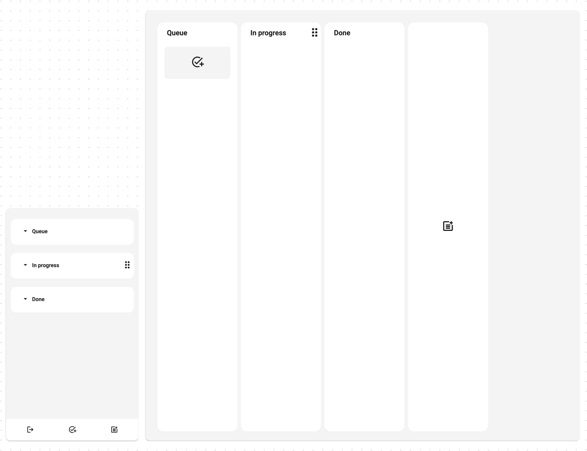

# Kanban Board

It enables oversight of the product development process, helping to identify bottlenecks and optimize production and employee efficiency.

---

### 🚀 **Check the website here** 👉 https://kanban-board-34b1c.web.app/

#### 🎥 **Check walkthrough video** 👉 https://youtu.be/Td0l7wSs03A

#### 🤝 👥 **Check video about cooperation** 👉 https://youtu.be/_B07oDhNlwY

---

### 📌 Key Features:

#### 🧱 1) Create Stages

Define clear stages of your product development pipeline to keep everything organized and structured.

#### ✅ 2) Create and Manage Tasks

##### Each task can include:

- 📝 Name
- 📅 Deadline
- 🔥 Priority
- 👥 Assigned team members
- 🧾 Task description
- 🔗 Relevant links
- 💬 Comments

#### 🚦 3) Task Limits Per Stage

Set a maximum number of tasks allowed in each stage to avoid overload.

#### 👥 4) Team Load Management

Limit the number of employees that can be assigned to a single task for balanced workload distribution.

#### 👀 5) Task Overview

Quickly see:

- ✅ If a task is done or needs review
- 📅 The deadline
- 👤 Number of team members working on it

#### 🖱️ 6) Drag and Drop

🔄 Move tasks between stages

🔀 Reorder stages

#### 🕒 7) Real-Time Collaboration

Work live with your team – see updates and changes as they happen!

#### 💻📱 8) Multiplatform Support

Use it across mobile, tablet, and desktop for seamless productivity anywhere.
